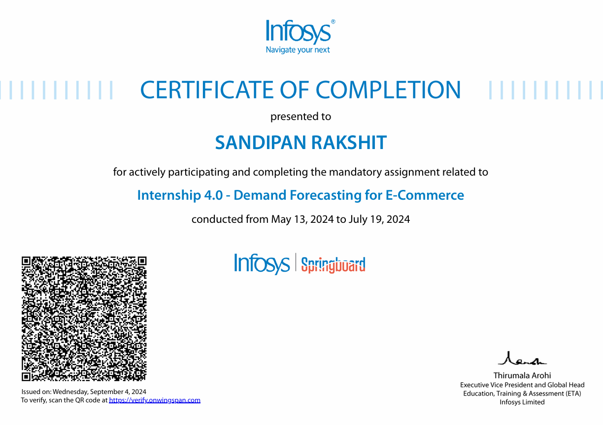

<h1 align="center">Demand Forecasting for E-Commerce</h1>

<p align="center">

</p>

<center> 

## Abstract:
In the dynamic landscape of e-commerce, accurate demand forecasting is crucial for optimizing inventory management, reducing operational costs, and enhancing customer satisfaction. This project leverages machine learning techniques to develop predictive models for forecasting future product demand based on historical sales data and external factors such as digital marketing metrics.
The dataset includes time-series data enriched with exogenous variables like Google clicks, Facebook impressions, and other relevant key performance indicators (KPIs) from Google Analytics. The forecasting models implemented include ARIMA, SARIMA, SARIMAX, and machine learning-based regression models. The project follows a structured approach involving data preprocessing, feature engineering, and model evaluation using performance metrics such as RMSE and MAPE.
By identifying trends, seasonality, and demand fluctuations, the model aids e-commerce businesses in making data-driven decisions, preventing stockouts, and optimizing supply chain operations. The insights derived from this project contribute to efficient resource allocation, cost savings, and improved customer experience in the e-commerce domain.

</br>
</br>

<p align="center">

<p align="center">Infosys, Bangalore</p>
</p>

## Project Overview

The **Demand Forecasting for E-Commerce** project is designed to develop a predictive model that accurately forecasts product demand based on historical sales data and key performance indicators (KPIs) from Google Analytics. The goal is to assist e-commerce businesses in optimizing inventory levels, reducing costs, and improving customer satisfaction by anticipating future product demand.

### Workflow

1. **Data Collection:**

   - Gathered historical sales data and KPIs, including clicks and impressions, from Google Analytics to form a comprehensive dataset for analysis.
2. **Data Preprocessing:**

   - Cleaned and preprocessed the data, addressing missing values and inconsistencies to ensure high-quality input for the model.
   - Performed exploratory data analysis (EDA) to understand trends, seasonality, and correlations between variables.
3. **Feature Engineering:**

   - Created new features to enhance the model's predictive capabilities, such as lag features, moving averages, and seasonality indicators.
   - Selected relevant features based on domain knowledge and statistical significance to improve model accuracy.
4. **Model Development:**

   - Implemented various machine learning algorithms, including:
     - **Time Series Models:** ARIMA, SARIMA
     - **Machine Learning Models:** Random Forest, XGBoost
   - Conducted hyperparameter tuning to optimize model performance and reduce forecasting errors.
5. **Model Evaluation:**

   - Evaluated model performance using metrics such as Mean Absolute Error (MAE) and Root Mean Squared Error (RMSE) to assess accuracy and reliability.
   - Split the dataset into training, validation, and test sets in a ratio of 0.8 : 0.1 : 0.1 for robust evaluation.
6. **Data Visualization:**

   - Created visualizations to illustrate trends, seasonality, and model performance using Matplotlib.
   - Generated plots to compare actual vs. predicted values, providing insights into model effectiveness.

### Technologies Used

- **Programming Language:** Python
- **Libraries:**
  - **Pandas:** For data manipulation and analysis.
  - **NumPy:** For numerical computations.
  - **Scikit-learn:** For implementing machine learning algorithms and evaluation metrics.
  - **Statsmodels:** For statistical modeling and time series analysis.
  - **Matplotlib:** For data visualization and plotting.
- **Tools:**
  - **Jupyter Notebook:** For interactive development and data exploration.
  - **Google Colab:** For cloud-based execution of Jupyter notebooks and sharing.

### Results and Impact

The model successfully predicts future product demand, providing valuable insights for inventory management and operational planning in e-commerce. The techniques applied in this project can help businesses make data-driven decisions, leading to improved efficiency and customer satisfaction.

The **Demand Forecasting for E-Commerce** project aims to develop predictive models that accurately forecast future product demand using historical sales data and various key performance indicators (KPIs) from Google Analytics, such as clicks and impressions. This project focuses on understanding trends and seasonality to help e-commerce businesses optimize their inventory management and improve customer satisfaction.

## Features

- **Time Series Analysis:** Utilizes historical sales data to identify trends and seasonal patterns.
- **Feature Engineering:** Incorporates various KPIs and external factors to enhance model accuracy.
- **Predictive Modeling:** Implements multiple machine learning algorithms to forecast future demand.
- **Data Visualization:** Visualizes results and forecasts to provide insights into demand trends.

## Technologies Used

- **Programming Language:** Python
- **Libraries:**
  - Pandas
  - NumPy
  - Scikit-learn
  - Matplotlib
  - Statsmodels
- **Tools:**
  - Jupyter Notebook
  - Google Colab

## Internship Certificate:

<p align="center">

</p>

## Quick Links:


[](https://github.com/sandipanrakshit34/Demand-Forecasting-for-E-Commerce/blob/main/Project_Report/Final_project_report.pdf) 
[](https://github.com/sandipanrakshit34/Demand-Forecasting-for-E-Commerce/blob/main/Project_Report/Project_Demand_Forecasting_Retailer.pdf) 
[](https://docs.google.com/presentation/d/1Kicm8kwjWTdiqZ7OPyQsURKM7Bsnam9J/edit?usp=sharing&ouid=104247672360361935051&rtpof=true&sd=true) 
[](https://github.com/springboardmentor139/Demand-Forecasting-For-E-commerce)


## References Used:
- https://www.ijmerr.com/v4n1/ijmerr_v4n1_10.pdf
- https://www.kaggle.com/competitions/walmart-recruiting-store-sales-forecasting/data
- https://www.researchgate.net/publication/354726783_A_Recent_Review_Article_on_Demand_Forecasting
- https://www.sciencedirect.com/science/article/pii/S2405896318313272
## Author

- [@sandipanrakshit34](https://github.com/sandipanrakshit34)

## Getting Started

To run the project locally, follow these steps:

1. **Clone the repository:**
   ```bash
   git clone https://github.com/sandipanrakshit34/Demand-Forecasting-for-E-Commerce.git


   ```

**[Project Link...](https://github.com/springboardmentor139/Demand-Forecasting-For-E-commerce)**

</p>
